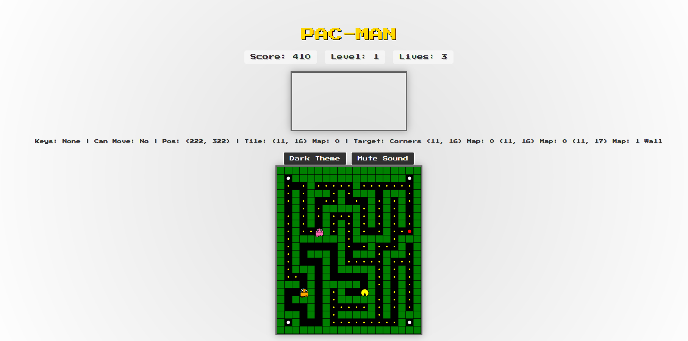

# Pac-Man Game


*A classic retro Pac-Man game built with p5.js, featuring modern accessibility and responsive design.*

## Play the Game

Try it out live at [Pacman Game](https://dibyaprokash.github.io/pacman/){:target="_blank"}!

## Overview
This is a browser-based Pac-Man game developed using [p5.js](https://p5js.org/){:target="_blank"}. It brings the classic arcade experience to your browser with a retro aesthetic, complete with power-ups, bonus fruits, ghost personalities, and level progression. The game includes modern enhancements like accessibility features, responsive design, and a polished user interface.

## Features
- **Classic Gameplay**: Navigate Pac-Man through a maze, eat dots, avoid ghosts, and collect power-ups to turn the tables.
- **Power-Ups**: Collect power pellets to temporarily eat ghosts for bonus points.
- **Bonus Fruits**: Fruits spawn every 30 seconds, granting extra points (100-500 based on difficulty).
- **Ghost Personalities**:
    - Blinky (red): Direct chase.
    - Pinky (pink): Predicts Pac-Man's movement 4 tiles ahead.
    - Inky (cyan): Alternates between chasing and random movement.
    - Clyde (orange): Chases when far, scatters when close.
- **Level Progression**: Collect all dots to advance levels, with increasing difficulty (tighter mazes, faster ghosts).
Animated Ghost Eyes: Ghosts’ pupils move based on their direction.
- **Map Themes**: Different wall and dot colors for each difficulty (Easy: green/yellow, Medium: gray/cyan, Hard: purple/pink).
- **High Score System**: Tracks high scores per difficulty, persisted in localStorage.
- **Sound Toggle**: “Waka” sound on dot collection, with mute/unmute option.
- **Animated Modal Transitions**: Smooth fade-in/slide-up animations for mode selection and game-over screens.
- **Lives System**: Start with 3 lives, lose one on ghost collision, respawn at the starting position.
Visual Feedback: Pac-Man pulsates during power-ups for a dynamic effect.
- **Retro UI**: Classic aesthetic with Press Start 2P font, gradient backgrounds, and a Pokédex-style modal.
- **Accessibility**:
  - ARIA attributes for screen reader support (stats, canvas, modals).
  - Keyboard navigation for modals (Arrow keys, Enter/Space, Escape).
  - Focus indicators on buttons.
- **Responsive Design**: Adapts to mobile screens (<600px) with scaled canvas and adjusted UI elements.
- **Theme Toggle**: Switch between dark and light themes for visual variety.

## Installation
1. **Clone the Repository**:
   ```bash
   git clone https://github.com/dibyaprokash/pacman.git
   cd pacman-game
   ```

2. **Run the Game**:
   - Option 1: Open **index.html** directly in a browser (file:// path).
   - Option 2: Use a local server for better performance (recommended):
    ```bash
    # Using VS Code Live Server
    code . # Open in VS Code
    # Use the "Go Live" button (requires Live Server extension)
    ```
    Then navigate to http://localhost:8000 in your browser.

3. **Dependencies**:
- The game uses p5.js and p5.sound.js, loaded via CDN:
    - p5.js: https://cdnjs.cloudflare.com/ajax/libs/p5.js/1.4.2/p5.min.js
    - p5.sound.js: https://cdnjs.cloudflare.com/ajax/libs/p5.js/1.4.2/addons/p5.sound.min.js
- No additional setup required.

## Gameplay Guide
1. **Start the Game**:
    - On page load, a modal prompts you to select a difficulty: Easy, Medium, or Hard.
    - Each difficulty adjusts maze density, ghost speed, and chase probability.

2. **Controls**:
    - Arrow Keys: Move Pac-Man up, down, left, or right.
    - Tab: Navigate through buttons (theme toggle, sound toggle, modal buttons).
    - Enter/Space: Select options in modals.
    - Escape: Close the game-over modal and restart.
    - Theme Toggle: Switch between dark and light themes.
    - Sound Toggle: Mute/unmute the “waka” sound.

3. **Objective**:
    - Eat all dots in the maze to advance to the next level.
    - Avoid ghosts unless powered up (white pellets).
    - Collect fruits for bonus points.
    - Survive with 3 lives; lose all lives to end the game.

4. **Scoring**:
    - Dots: 10 points each.
    - Power Pellets: 50 points.
    - Ghosts (during power-up): 200 points each.
    - Fruits: 100 (Easy), 300 (Medium), 500 (Hard) points.

5. **Game Over**:
    - Lose all lives to trigger the game-over modal.
    - View your score and high score, then restart via the mode selection modal.

## Accessibility
- **Screen Reader Support**:
    - Stats (score, level, lives) and debug logs are announced via aria-live="polite".
    - Modals have role="dialog" and aria-labelledby for proper labeling.
    - Canvas is marked with role="region" and an aria-label.
- **Keyboard Navigation**:
  - Use Tab to focus on buttons.
  - In modals, use Arrow keys to cycle through options, Enter/Space to select, and Escape to close the game-over modal.
  - Focus indicators are visible on all interactive elements.

## Technical Details
- **Built With**:
    - p5.js for rendering and game logic.
    - p5.sound.js for the “waka” sound effect.
    - Press Start 2P font for retro styling.
- **File Structure**:
    - index.html: The main game file containing HTML, CSS, and JavaScript.
- **Browser Compatibility**:
    - Tested on Chrome, Firefox, Safari, and Edge (latest versions as of April 2025).
    - Works on mobile browsers with responsive adjustments.

## Contributing
Contributions are welcome! To contribute:
1. **Fork the Repository**:
   ```bash
   git clone https://github.com/dibyaprokash/pacman.git
   ```

2. **Create a Branch**:
    ```bash
    git checkout -b feature/your-feature-name
    ```

3. **Make Changes**:
    - Add new features, fix bugs, or improve documentation.
    - Ensure code style consistency (e.g., use spaces, follow existing patterns).
  
4. **Test Your Changes**:
    - Test gameplay, UI, accessibility, and responsiveness.
    - Verify no console errors.
  
5. **Commit and Push**:
    ```bash
    git add .
    git commit -m "Add your feature or fix description"
    git push origin feature/your-feature-name
   ```

6. **Create a Pull Request**:
- Open a pull request on GitHub with a detailed description of your changes.

## Known Issues
- **p5.js Source Map 404**: You may see 404 errors for p5.js source maps in the console. These are harmless and can be ignored (p5.js CDN issue).
- **Performance on Low-End Devices**: May experience slight lag on very low-end devices due to p5.js rendering. Consider optimizing draw calls if needed.

## License
This project is licensed under the MIT License. See the  file for details.

## Acknowledgments
- Inspired by the classic Pac-Man arcade game.
- Built with p5.js, a JavaScript library for creative coding.


*Happy gaming! If you encounter issues or have feature requests, please open an issue on GitHub.*